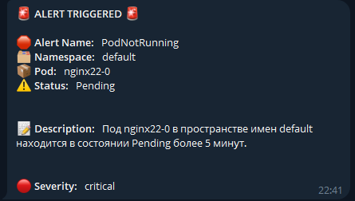

# k8s-monitoring-stack

Репозиторий содержит конфигурации для развёртывания системы мониторинга в кластере `Kubernetes`. Включены следующие компоненты:

- **`Prometheus`** — для сбора метрик.
- **`Alertmanager`** — для обработки и маршрутизации алертов.
- **`Grafana`** — для визуализации данных.
- **`Node Exporter`** — для сбора системных метрик с узлов.
- **`Kube State Metrics`** — для мониторинга состояния ресурсов Kubernetes.
- **`Loki`** — система для сбора и агрегирования логов.
- **`Promtail`** — агент для сбора логов и отправки их в Loki

---


---

## Схема взаимодействия

1. **Node Exporter** и **Kube-state-metrics**:
   - Сами по себе не хранят метрики.
   - Предоставляют данные для Prometheus.

2. **Prometheus**:
   - Периодически собирает данные из:
     - Node Exporter — для метрик хостов.
     - kube-state-metrics — для состояния объектов Kubernetes.
     - cAdvisor (встроен в kubelet) — для метрик контейнеров.
   - Сохраняет метрики и обрабатывает их.
   - Отправляет алерты в Alertmanager.

3. **Alertmanager**:
   - Получает алерты от Prometheus.
   - Отправляет уведомления (например, в Telegram или Email).

4. **Grafana**:
   - Использует Prometheus как источник данных.
   - Строит графики и дашборды для визуализации метрик.

5. **Promtail:**
   - Сбор логов с контейнеров и хостов.
   - Отправка логов в Loki.

6. **Loki:**
   - Хранение и индексация логов.
   - Позволяет Grafana искать и визуализировать логи.

   ```bash
   Kubernetes Cluster
      ├── kubelet (cAdvisor) → Prometheus
      ├── kube-state-metrics → Prometheus
      ├── Node Exporter → Prometheus
      │
      ├── Prometheus
      │    ├── (хранение метрик)
      │    ├── (отправка алертов → Alertmanager)
      │    └── (экспорт данных → Grafana)
      │
      ├── Promtail → Loki (сбор и отправка логов)
      ├── Loki (хранение и индексация логов)
      │    └── Grafana (визуализация логов)
      │
      ├── Alertmanager (уведомления: email, Telegram)
      │
      └── Grafana (визуализация метрик и логов)
   ```

## Основные компоненты

### [Prometheus](https://github.com/prometheus/prometheus)

Prometheus — система мониторинга и сбора метрик. Основные функции:

- Собирает метрики из различных источников (экспортеров, компонентов Kubernetes, приложений).
- Позволяет выполнять запросы на языке PromQL для анализа метрик.
- Передает предупреждения в Alertmanager.

---

### [Node Exporter](https://github.com/prometheus/node_exporter)

Node Exporter предоставляет метрики о ресурсах хоста:

- Использование CPU, памяти, дисков.
- Сетевые метрики.
- Состояние файловой системы.

**Особенности:**

- Node Exporter запускается на каждом узле (используется DaemonSet).
- Метрики доступны по HTTP (`/metrics`).
- Prometheus собирает эти метрики для мониторинга состояния узлов.

---

### [Kube-state-metrics](https://github.com/kubernetes/kube-state-metrics)

kube-state-metrics — это компонент, предоставляющий метрики о состоянии объектов Kubernetes (а не о ресурсах, как cAdvisor).

- Выполняет запросы к API Kubernetes.
- Преобразует состояние объектов Kubernetes в метрики для Prometheus.

---

### [cAdvisor](https://github.com/google/cadvisor/)

cAdvisor встроен в kubelet и автоматически предоставляет метрики о контейнерах, работающих на узле Kubernetes.

- Метрики доступны через API kubelet по адресу `/metrics/cadvisor`.

**Метрики:**

- CPU.
- Память.
- Диск.
- Сеть.

---

### [Alertmanager](https://prometheus.io/docs/alerting/latest/alertmanager/)

Alertmanager отвечает за управление алертами, которые отправляет Prometheus.

- Prometheus отправляет алерты в Alertmanager через HTTP.
- Alertmanager обрабатывает алерты и отправляет уведомления в соответствии с конфигурацией (Email, Telegram и т.д.).

---

### [Loki](https://github.com/grafana/loki)

Loki — система для сбора и агрегирования логов, интегрированная с Grafana. Он позволяет собирать логи из различных источников и отображать их в Grafana для анализа.

- Логирование контейнеров и приложений в Kubernetes.
- Легковесный и масштабируемый.
- Позволяет эффективно искать и фильтровать логи.

---

### [Promtail](https://grafana.com/docs/loki/latest/send-data/promtail/installation/)

Promtail — это агент для сбора логов и отправки их в Loki. Он извлекает логи из файлов на каждом узле, а затем передает их в Loki для хранения и анализа.

- Метки и метаданные могут быть добавлены на основе контейнеров или Kubernetes ресурсов.

---

### [Grafana](https://grafana.com/)

Grafana — инструмент для визуализации данных.

- Подключается к Prometheus и Loki.
- Создает дашборды для анализа метрик.
- Поддерживает гибкую настройку графиков, панелей и алертов.

## Установка

### Настройка k8s

Создаем **namespace** - `monitoring`:

   ```bash
   kubectl create namespace monitoring`
   ```

Деплоим `Node-exporter`:

   ```bash
   kubectl apply -f 1.k8s-node-exporter
   ```

Деплоим `Kube-state-metrics`:

   ```bash
   kubectl apply -f 2.kube-state-metrics
   ```

Деплоим `Prometheus`, для включения `Ingress` правим файле `prometheus-ingress.yaml`:

   ```bash
   kubectl apply -f 3.k8s-prometheus
   ```

Деплоим `Grafana`:

   ```bash
   kubectl apply -f 4.k8s-grafana
   ```

Деплоим `Loki`:

   ```bash
   kubectl apply -f 6.k8s-loki
   ```

Деплоим `Alert-manager`:

   ```bash
   kubectl apply -f 5.k8s-alert-manager
   ```

   В файле `AlertManagerConfigmap.yaml` указывается `id TelegramBot` и `ID Chat`, в который будут отправляться алерты, например:

- 

---

### Доступы

Доступы огранизованы через `NodePort`:

- Prometheus доступен по порту: **30000**

- Alert-manager доступен по порту: **31000**

- Grafana доступна по порту: **32000** (учетная запись - admin\admin)

---

### Примечание

Для тестирования отображения логов создается тестовый pod [Log-Generator](./6.k8s-loki/log-generator.yaml) с контейнером `busybox`.
